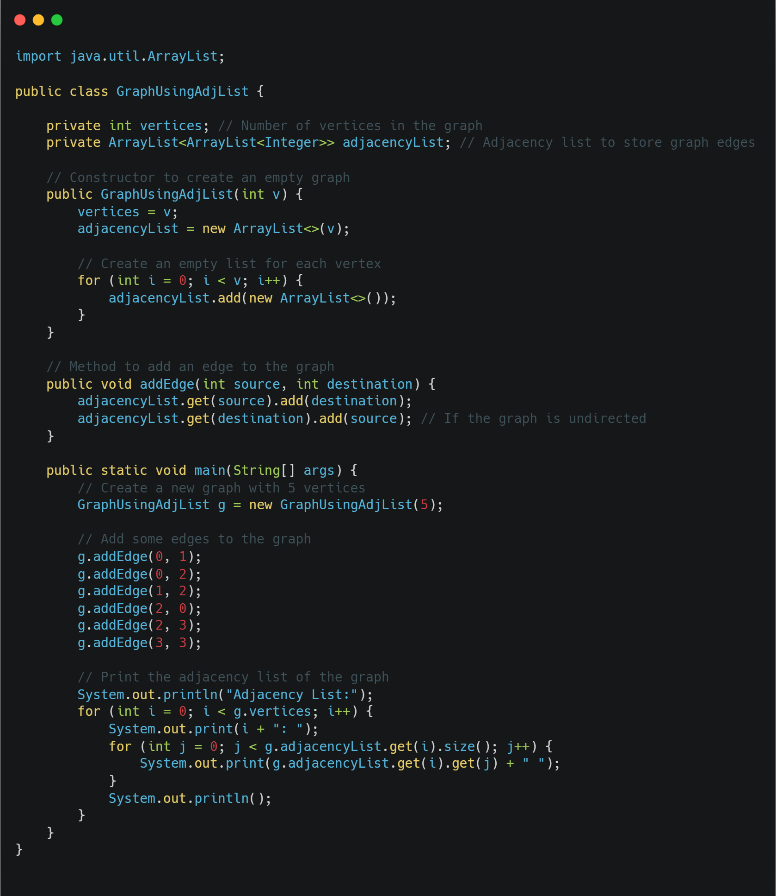
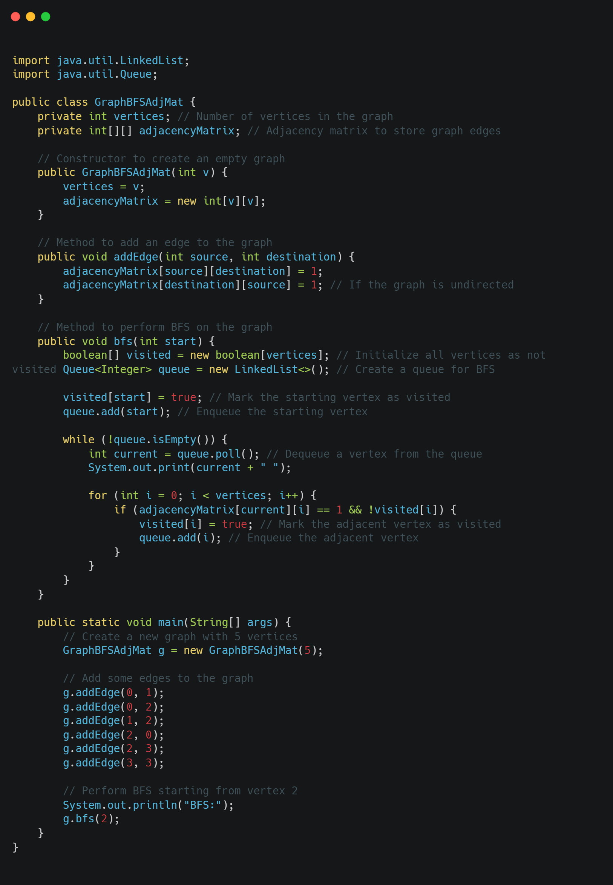
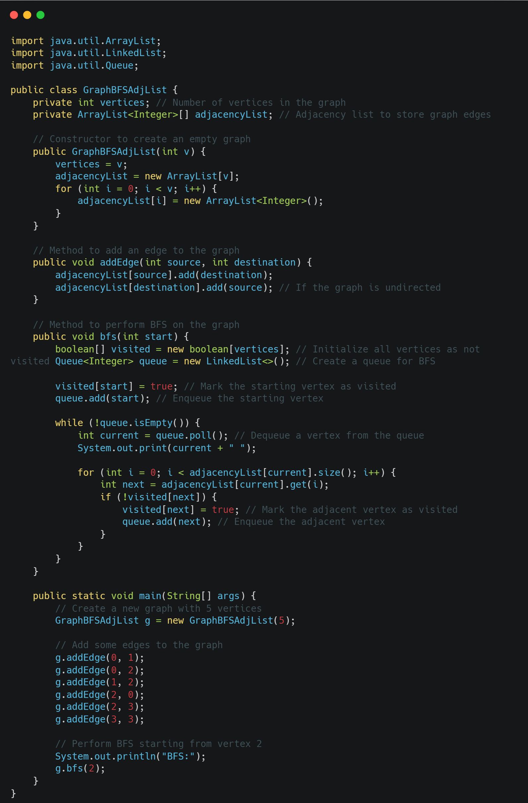

# Graphs

A graph data structure is a way of representing a collection of objects, called vertices or nodes, and the relationships or connections between them, called edges. Graphs are commonly used in computer science and other fields to model complex systems or networks.

Graphs can be directed, meaning that the edges have a specific direction, or undirected, meaning that the edges have no direction. They can also be weighted, meaning that each edge has a numerical value associated with it, or unweighted, meaning that each edge has no value.

 

## Graph Representation

There are several ways to represent a graph data structure, including:

1. **Adjacency matrix**: a 2D array where the elements represent the presence or absence of edges between vertices. The matrix has a size of V x V, where V is the number of vertices in the graph.
2. **Adjacency list**: a collection of linked lists, where each list corresponds to a vertex in the graph and contains the vertices that are adjacent to it.
3. **Incidence matrix**: a 2D array where the rows represent the vertices and the columns represent the edges. Each element in the matrix represents the relationship between a vertex and an edge.

Graph data structures are used in many applications, including network routing, social network analysis, and recommendation systems. They can be traversed and searched using algorithms such as breadth-first search (BFS) and depth-first search (DFS), and their properties can be analyzed using various graph theory concepts, such as connectivity and centrality.

### [Adjacency Matrix Representation of Graph in Java](Implementation/GraphUsingAdjacencyMatrix.java)

  
### [Adjacency List Representation of Graph in Java](Implementation/GraphUsingAdjList.java)

 

## Graph Traversals
Graph traversals are a way to travel and access/print the nodes in the graph. There are two ways to do traversal in a graph.

**Depth First Search (DFS)**

When you pick up a node and travel all the way down, and then check for any other node.

### [DFS in Graph using Adjacency Matrix](Traversal/GraphDFSAdjMat.java)

### [DFS in Graph using Adjacency List](Traversal/GraphDFSAdjList.java)

**Breadth First Search (BFS)**

When you pick up a node and traverse it's neighbours at the present depth before moving in deep. 

### [BFS in Graph using Adjacency Matrix](Traversal/GraphBFSAdjMat.java)

### [BFS in Graph using Adjacency List](Traversal/GraphBFSAdjList.java)

